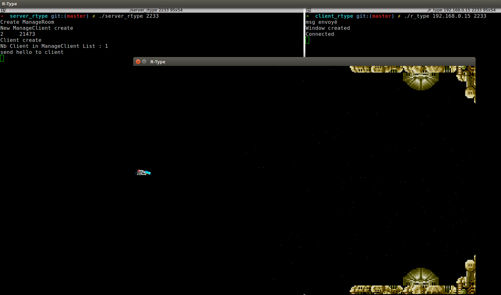
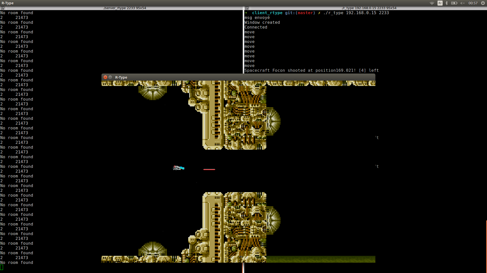

# cpp_rtype

Epitech second third project : cpp_rtype

Advanced C++ Programming 2 module

Deadline : 2 weeks

Beginning of the project : 08/01/2018, 00h00

Group size : 4 persons

Contributor : 

-[beche_f](https://github.com/Francoisbeche)

-colett_j

-bourre_q

## Description

For this project of the Advanced C++ knowledge unit, R-Type will introduce you to networked video game development, the R-Type.

You will have to implement a multi-threaded server and a graphical client, using a re-usable game engine of your own design.

The purpose of this project is to create a one-to-four player game, using a client/server architecture. This is important. It MUST be a client/server architecture. Peer-to-peer communication is not allowed.

-[R-type](https://en.wikipedia.org/wiki/R-Type)

## Getting started

These instructions will allow you to obtain a copy of the operational project on your local machine for development and testing purposes.

### Prerequisites

What do you need to install the software and how to install it?

```
gcc
c++11
lsfml-graphics
lsfml-audio
lsfml-window
lsfml-system
```

### Installation

Here's how to start the project on your computer

Clone and go in the directory cpp_arcade

Project compilation

* Game Engine
```
cd client_rtype/game_engine && make  //compile the game engine
mv libgame_engine.so ..
```
* Client
```
cd client_rtype
export LD_LIBRARY_PATH=`pwd`
make
```
* Server
```
cd server_rtype 
./compile.sh
```

Running project

```
./server_rype IP PORT
./r_type IP PORT 
```

## Screenshot




## Build with

* [C++](https://en.wikipedia.org/wiki/C%2B%2B)

## Autor

* **David Munoz** - [DavidMunoz-dev](https://github.com/davidmunoz-dev)
